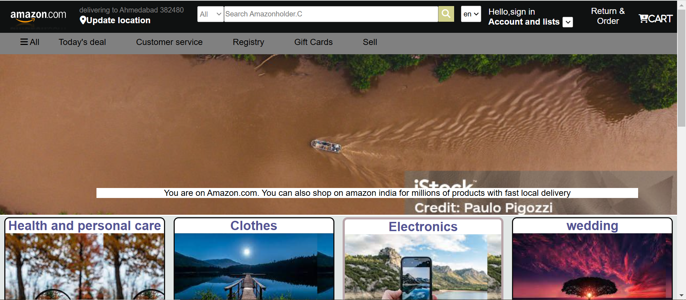

# Amazon Clone Frontend 🌟

A simple and beautiful **Amazon clone** UI built using **HTML** and **CSS**. This project is a replica of Amazon's homepage, with a similar structure and design, but customized to fit a beginner-friendly implementation. This is my **first-ever HTML and CSS project**, focusing on learning and improving frontend development skills.

---

## Features
- **Beautiful Design**: A visually appealing user interface that closely resembles the Amazon website.
- **Static Layout**: The layout is fixed and non-responsive.
- **Custom Footer**: Includes random placeholder text instead of the actual footer content from Amazon's website.

---

## Project Structure
